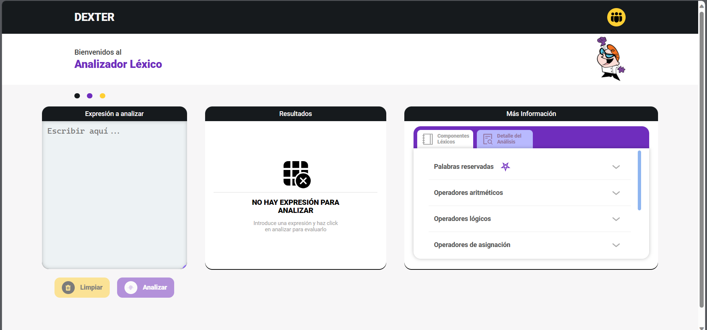
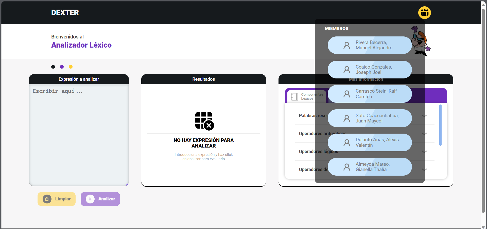
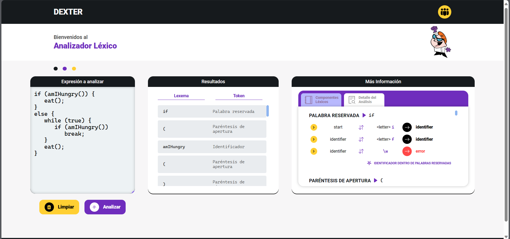
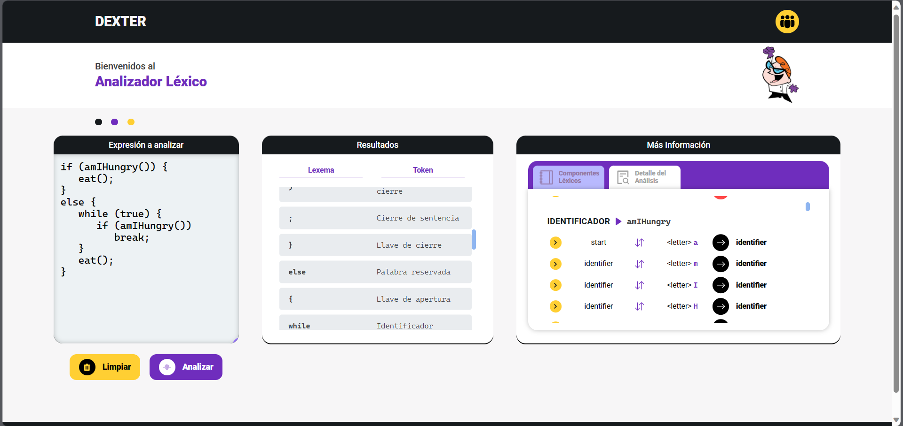

# **Dexter - Analizador léxico**

Un analizador léxico para el curso de Compiladores de VI ciclo de la carrera de Ing. de sistemas.
Desarrollado como React JS y diseñado a nivel de UI en Figma.
[Ver prototipado](https://www.figma.com/file/7FKICMJcc4e9TAMgSJKzwV/Lexical-Analizer?node-id=0%3A1)

## Integrantes del grupo

-   Rivera Becerra, Manuel
-   Carrasco Stein, Ralf
-   Soto Ccaccachahua, Maycol
-   Almeyda Mateo, Gianella
-   Ccaico Gonzales, Joel
-   Dulanto Arias, Alexis

## Instrucciones

1.  Instalar dependencias:

```powershell
npm i
```

2.  Correr en desarrollo:

```powershell
npm run dev
```

## Herramientas

-   Empaquetador vite.
-   React JS.
-   styled-components.
-   iconify.

## Screenshoots

<div style="display: flex; justify-content: center; gap: 15px; flex-wrap: wrap" align="center">
    
    
    
    
    
    
</div>
